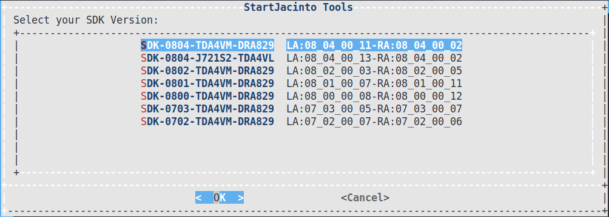

# StartJacinto

## 工具介绍

**StartJacinto Tools** 是由Fredy 开发的”All in One” 的开发环境。 目的是在一个终端下能够进行嵌入式处理器的所有工作。 也可适用于日常的项目的部署和管理。

当前StartJacinto tools 主要涉及的处理器是Jacinto处理器，未来还可能扩展到sitara处理器， 主要功能如下：

1. 管理SDK的不同版本 （SDK开发过程中会使用到多个版本的SDK）
2. 直接更新image 到SD，制作SD卡，更新文件系统、资源文件到SD。
3. 一键安装系统所需要的SDK。
4. 管理开发过程中使用的工具，补丁包。
5. 支持Yocto环境的开发
6. Ubuntu相关的工具安装和使用。
7. 管理项目的不同版本，支持一键部署。
8. ……

如果您在使用中有其他的需求，可以联系我，将会考虑在后期的版本将其加入进来。

## 工具原理

**[makefile](https://baike.baidu.com/item/Makefile)** ：一个工程中的源文件不计其数，其按类型、功能、模块分别放在若干个目录中，makefile定义了一系列的规则来指定哪些文件需要先编译，哪些文件需要后编译，哪些文件需要重新编译，甚至于进行更复杂的功能操作，因为 makefile就像一个[Shell脚本](https://baike.baidu.com/item/Shell脚本/572265)一样，也可以执行操作系统的[命令](https://baike.baidu.com/item/命令/13020279)。

**Shell** 脚本(shell script),是一种为 shell 编写的脚本程序。

本工具基于**makefile**和**shell** ，借用makefile一系列的规则，组合了shell脚本，从而使开发流程简化，流程自动化， 从而给我们系统开发工作带来了非常多的便捷性。节省时间的同时，增加了开发的趣味。

工具的基本原理是：依据环境变量（env-setup*.sh）的设定，确定了工作的路径，SDK的版本等等，然后根据build flag 确定了当前环境所包含的内容（所使用到的命令，工具，补丁等），最后，执行当前环境的可执行的命令。 所以使用流程如下：

1. 打开console ，
2. 进入到 startJacinto目录，
3. 执行 source env*
4. 选择要使用的SDK
5. 执行相关的命令

 **查看工具的配置，变量使用如下的命令** ：

```
make print_all
make print_config
make print_env
make print_variable
```

## 开发环境及工具下载

| 类型              | 说明                                                                                          |
| ----------------- | --------------------------------------------------------------------------------------------- |
| 项目地址          | [https://github.com/fredyzhang2018/startJacinto](https://github.com/fredyzhang2018/startJacinto) |
| PC环境            | Ubuntu18.04                                                                                   |
| Jacinto7 支持版本 | SDK0703 SDK0800 SDK0802 SDK0804                                                               |
| 支持的Soc         | TDA4VM TDA4AL/VL/VM Eco                                                                       |

# Rules

## Variable Name

1. all the global variable: `SJ_*`
2. all the global path    : `SJ_PATH_*`
3. all the internal module: `SJ_PDK_* (PDK example)`

## rules

```
---env     --------------- makerules   
---scripts ---------------
---patch   ---------------  
```

# 使用指导

## 设置环境变量启动StartJacinto工具

```
[SDK-0804-TDA4VM-DRA829]:~/startJacinto> source ui_env_setup_jaicinto.sh
```

执行上面的命令后，出现如下界面，选择对应的SDK版本。





## TIDL

### Inference and import

Fredy Tools model zoos support import the images list. Two model

1. input_imges
   1. this mode, need to create a dictory on model dictory.
   2. startjacinto tools : TIDL makefile set :  SJ_TIDL_INFERENCE_CONFIG_LIST as no.
   3. EVM inference should set to no also .
2. input_imges_list
   1. if  the dictory of input_images_list is exist, then model will import follow the list \.
   2. Startjacinto tools : TIDL makefile setting : SJ_TIDL_INFERENCE_CONFIG_LIST as yes
   3. EVM inference scripts should set to : yes .
3. check the trace /feature map ,etc
   1. tidl-model-check-feature-map
   2. tidl-model-check-inference-trace

- Import the model and run on pc, you should check the makefile_tidl.mk for configure.
  `tidl-model-import-inference-run`
- imnet onnx example

  `tidl-model-onnx-imnet`
- set up the model to sd card over scp: `tidl-model-sd-model-setup`

### Run Inference on PC

1. Import and run inference on PC: `tidl-model-import-inference-run`

### Run Inference on EVM

tidl-model-inference-run-evm    :  Run inference on EVM
tidl-model-run-on-evm-setup     :  evm run command
tidl-model-zoo-download         :  Model  download

1. SD card model setup: `tidl-model-sd-model-setup`
2. Run inference on EVM: `tidl-model-inference-run-evm`
3. Compare the result: `tidl-model-check-inference-trace`

### TIDL BULD

* Download and setup :  `make tidl-src-download-setup `
* Download and setup adds on package: `tidl-src-addon-packages`
* Build the TIDL dependent: `tidl-src-build-dependent`
* Build the TIDL SRC: `tidl-src-build-pc`
* Build the TIDL SRC: `tidl-src-build-pc`

```
tidl-src-addon-packages  # install the protobuf  FlatBuffer FlatBuffer
tidl-src-build-evm       # build all TIDL Runtime
tidl-src-build-pc        # build all TIDL for PC emulation
tidl-src-download-setup  # Download Repo
tidl-src-build-dependent # graphviz build 
```

## BOOT FLow

### Solution 1:  SPL - Linux

Default SDK.

### Solution 2: SBL - Linux (no uboot)

please notice, below command need to update sdk makefile

1. sbl-bootimage-sd
2. sbl-vision_apps-bootimage
3. sbl-linux-bootimage
4. make sbl-sd-bootimage-install

### Solution3 : SBL  --> SPL --> uboot --> Linux

`ROM --> R5 SBL --> SPL  --> uboot -->  A72 ATF --> Kernel`

1. make mcusw-sbl-boot-u-boot      # setting mode: deveopment, optimized is for quick boot.
2. make mcusw-sd-sbl-boot-u-boot # setting mode.

### OSPI Flash

SDK8.2 Test : TFTP boot.

For Non HS board.  You can boot from DFU , using the K3 conf NFS boot.

1. sbl-ospi-bootimage-install-tftp
2. Flash the image : tftp --> RTOS

   ```

   dhcp
   setenv serverip 10.85.130.60 
   sf probe 
   tftp ${loadaddr} sbl_cust_img_mcu1_0_release.tiimage
   sf update $loadaddr 0x0     $filesize
   tftp ${loadaddr} tifs.bin 
   sf update $loadaddr 0x80000 $filesize
   tftp ${loadaddr} can_boot_app_mcu_rtos_mcu1_0_release_ospi.appimage
   sf update $loadaddr 0x100000  $filesize 
   tftp ${loadaddr} lateapp1
   sf update $loadaddr 0x1fc0000  $filesize 
   tftp ${loadaddr} lateapp2
   sf update $loadaddr 0x27c0000  $filesize 
   tftp ${loadaddr} atf_optee.appimage
   sf update $loadaddr 0x1c0000  $filesize 
   tftp ${loadaddr} tikernelimage_linux.appimage
   sf update $loadaddr 0x7c0000  $filesize 
   tftp ${loadaddr} tidtb_linux.appimage
   sf update $loadaddr 0x1ec0000  $filesize 
   # OSPI PYH Pattern 
   tftp ${loadaddr} nor_spi_patterns.bin 
   sf update $loadaddr 0x3fe0000  $filesize 
   ```
3. Flash the psdkla sdk.

   ```
   # Linux 
   dhcp
   setenv serverip 10.85.130.60 
   sf probe
   tftp ${loadaddr} tiboot3.bin
   sf update $loadaddr 0x0 $filesize
   tftp ${loadaddr} tispl.bin
   sf update $loadaddr 0x80000 $filesize
   tftp ${loadaddr} u-boot.img
   sf update $loadaddr 0x280000 $filesize
   tftp ${loadaddr} sysfw.itb
   sf update $loadaddr 0x6C0000 $filesize

   ```
4. HS board tftp : make hs-ospi-bootimage-install-tftp.

## Security

[Markdown-Security](./docs/jacinto7/jacinto7_module_security.md)

### Keywriter

1. install the key writer.

SOC Analysis:  make ra-hs-check-uart-boot-log  python analysis the security chip log. Thanks.

### SBL build

Tested on SDK8.2. it works well. Before build, You should set the chip silicon.

`vision_apps/vision_apps_build_flags.mak`

```
J7ES_SR?=1_1
```

Then follow the below step to generate the hs image: SBL/app/can boot app.

SBL-CAN BOOT APP --> LINUX

1. `make hs-sbl-bootimage-sd`
2. `hs-sbl-vision-apps-bootimage`
3. hs-sbl-linux-bootimage
4. `hs-sd-sbl-bootimage-install-sd`

Combined Image:

1. hs-sbl-linux-combined-bootimage
2. hs-sd-sbl-combined-bootimage

## Build PSDKLA

Simalar as SDK.

```
make la-*
```

### Install the SDK

`make la-install-sdk`

## Build PSDKRA

Similar as SDK.

```
make ra-*
```

### Install the PSDKRA

`make ra-install-sdk`

### minifest

#### Manifest Setup

```
	manifest-update-local-repo    : update repo from remote to local(Internal using)"
	manifest-repo-init            : init repo in SJ_PATH_PSDKRA"
	manifest-repo-sync            : Sync the repo"
	manifest-install              : install the repo minifest to sdks  "
```

#### Manifest Build

1. Enable PSDK RTOS for Linux+RTOS mode (NOTE: this is default and documented here for reference only)
   Edit `tiovx/build_flags.mak` and modify below variable, `BUILD_LINUX_A72?=yes`
2. Build PSDK RTOS by doing below in "vision_apps" `make sdk -j8`
3. Copy application related files to target filesystem in SD card, by doing below in "vision_apps"
   `make linux_fs_install_sd`
   OR
   `make linux_fs_install_sd PROFILE=debug` (to copy the debug versions to the filesystem)
4. Copy test data files to SD card (required for some demos, typically needs to be done once)
   `make linux_fs_install_sd_test_data`

### install

```
    ra-install-dependencies           : install sdk dependencies
    ra-ccs-setup-steps                : print the ccs setup steps
    ra-install-targetfs               : install the PSDKLA filesytem to PSDKRA
    ra-install-sdk                    : Install SDKs
```

### SD card setup

```
    ra-sd-help
    ra-sd-mk-partition-method                   : print SD card partition method.
    ra-sd-mk-partition                          : make sd card parttion
    ra-sd-install-rootfs                        : install filesystem to SD card
    ra-sd-install-auto-ti-data                  : install the auto ti data
    ra-sd-linux-fs-install-sd               　　: install images to SD card
    ra-sd-linux-fs-install-sd-debug             : install the debug version images to SD card
    ra-sd-linux-fs-install-sd                   : install the auto ti data
    ra-sd-linux-fs-install-sd-test－data         : --> internal using
```

## OpenVX

### Tutorial

```
tiovx_tutorial_exe_build # build the tiovx tutorial 
tiovx_tutorial_exe_run   # run the tutorial app

```

### Pytiovx

usecase

```
# Kernel 
tiovx-pyovx-generate-new-kernel

# usecase
tiovx-pyovx-generate-new-app
tiovx-pyovx-generate-new-app-run
```

## Yocto Support

### local build

build yocto use below command:

1. la-yocto-install --> install the yocto env.
2. la-yocto-build   --> yocto build.

### docker yocto support.

- Docker setup on Ubuntu
  1. run `ubuntu-docker-install`           --> docker install
  2. run `ubuntu-docker-test`              --> docker testing
  3. run `ubuntu-install-docker-yocto`     --> install docker ubuntu18 image
- start docker
  1. run `ubuntu-docker-yocto-ubuntu18-j7` --> docker ubuntu18 start.
  2. run `su fredy`                        --> password (123)
  3. run `cd startJacinto`
  4. run `make la-yocto-install`
  5. run `make la-yocto-build`

## Gateway Demo

1. PCAN tools setup ： `make ubuntu-install-pcan-tools`
2. Build the demo:     `make gateway-build`
3. Run the demo:

# Remote Environment

You can use the TDA4 EVM board to setup a remote debug envrionment. More details, please refer to below:
    **Hardware**: USBRELAY to power-on and power-off the baord.
    **K3-Switch Tool**: boot the board  with different boot mode over the DFU.

## USBRELAY

I am using the USBRELAY and tested on my envrionment.
Install the driver: `make ubuntu-install-usbrelay`

### USBRELAY using

1. power-on  the board: `make ubuntu-usbrelay-start`
2. power-off the board: `make ubuntu-usbrelay-close`

## k3 switch Tool

k3 bootswitch tools introduction

1. USB connect to Linux PC
2. main_uart connect to Linux PC
3. * j721e-evm settings  => SW8 = 1000 0000      SW9 = 0010 0000      SW3 = 0101 00 1010
4. USB replay setup:  cp k3bootswitch.conf ~/HOME/.config/
   (usbrelay HURTM_1=0 HURTM_2=0 && sleep 0.5 && usbrelay HURTM_1=1 HURTM_2=1 && sleep 0.1) >/dev/null 2>&1

install
`sudo apt-get install dfu-util`
boot in differenct mode

```
	sudo ./dfu-boot.sh --j721e-evm --bootmode mmc
	sudo ./dfu-boot.sh --j721e-evm --bootmode emmc
	sudo ./dfu-boot.sh --j721e-evm --bootmode ospi
	sudo ./dfu-boot.sh --j721e-evm --bootmode uart
    sudo ./dfu-boot.sh --j721e-evm --bootmode noboot
```

mount the sd/emmc

```
    sudo ./dfu-boot.sh --j721e-evm --mount 0 //eMMC
	sudo ./dfu-boot.sh --j721e-evm --mount 1 //SD
```

# Ubuntu

## ubuntu install opencv

`make ubuntu-install-opencv`

# Release notes

## 202209 1st release : 30_00_00

1. Gateway Demo support.
2. Support New UI.
3. Support J721S2.
4. Tested SDK8.4

## 202108 1st release : 20_01_00

1. PSDKLA & PSDKRA supported.

## 202108 1st release : 20_00_00

1. Yocto
   - yocto build support.
   - yocto docker env setup.
2. env restructure.
3. ubuntu support.

## 202105 1st release : 10_00_00

- support PSDKLA 0703 and PSDKRA0703.

# License

[MIT License](./docs/LICENSE)
